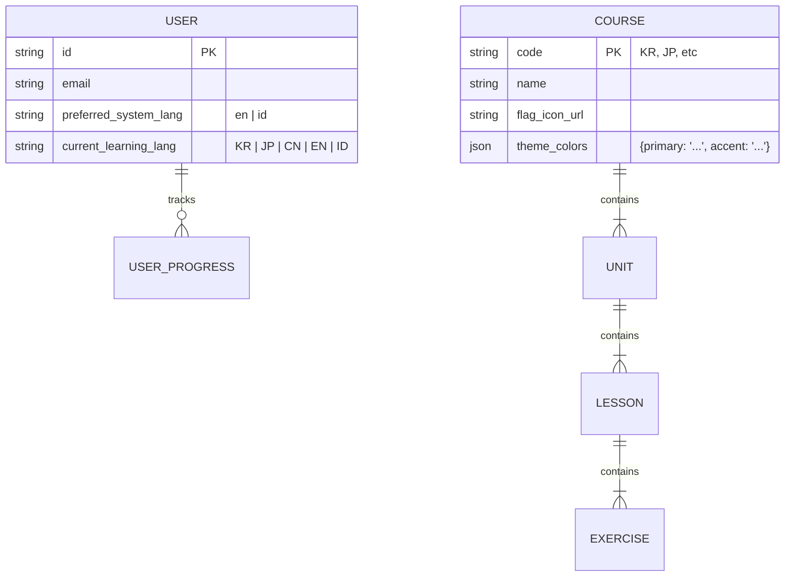

# Blueprint: LinguaFlow (Dynamic Themed Language Learning)

## 1. Executive Summary

**LinguaFlow** adalah platform belajar bahasa (Korea, Jepang, China, Inggris, Indonesia) yang tersedia di Web dan Mobile.

**Unique Selling Point (USP):**

* **Dynamic Flag-Based UI:** Tema warna aplikasi berubah total secara *real-time* mengikuti bendera bahasa yang sedang dipelajari (Immersive Experience).
* **Cross-Platform Sync:** Progress belajar di Web (Next.js) dan Mobile (Flutter) tersinkronisasi sempurna.
* **System Localization:** Interface tersedia dalam Bahasa Inggris (Default) dan Bahasa Indonesia.

---

## 2. Tech Stack

### A. Frontend Web (Next.js)

* **Framework:** Next.js 14+ (App Router).
* **Language:** TypeScript (Strict Mode).
* **Styling:** Tailwind CSS + CSS Variables (untuk *dynamic theming*).
* **State Management:** Zustand (Ringan & Clean).

### B. Mobile App (Flutter)

* **Framework:** Flutter 3.x.
* **Language:** Dart.
* **State Management:** Riverpod (Clean Architecture friendly).
* **Styling:** Flutter ThemeData + Extensions.

### C. Backend API

* **Core:** Python Django / NestJS (Disarankan Django karena Anda sudah familiar).
* **Database:** PostgreSQL (Relational Data).
* **Auth:** JWT (JSON Web Token) untuk session yang stateless antar Web & Mobile.

---

## 3. Dynamic Theming Strategy (The "Flag" Logic)

Ini adalah fitur visual utama. Kita tidak men-*hardcode* warna, tapi menggunakan **Design Tokens**.

### Color Mapping Logic

Setiap bahasa memiliki konfigurasi palet warna (Primary, Secondary, Accent, Background).

| Bahasa Code  | Negara          | Primary (Dominan)  | Secondary            | Accent                  | Background Tip   |
| :----------- | :-------------- | :----------------- | :------------------- | :---------------------- | :--------------- |
| **KR** | Korea           | `#0047A0` (Blue) | `#CD2E3A` (Red)    | `#000000` (Black)     | White/Clean      |
| **JP** | Jepang          | `#BC002D` (Red)  | `#FFFFFF` (White)  | `#B5B5B5` (Grey)      | Minimalist White |
| **CN** | China           | `#DE2910` (Red)  | `#FFDE00` (Yellow) | `#FFDE00`             | Warm White       |
| **EN** | Inggris (US/UK) | `#00247D` (Navy) | `#CF142B` (Red)    | `#FFFFFF` (White)     | Cool Grey        |
| **ID** | Indonesia       | `#FF0000` (Red)  | `#FFFFFF` (White)  | `#4A4A4A` (Dark Grey) | Clean White      |

### Implementation Strategy

1. **Web (Tailwind):** Menggunakan CSS Variables di `:root`. Saat user ganti bahasa, kita update value variabel tersebut via JavaScript.
   ```css
   :root {
     --color-primary: #0047A0; /* Default value */
     --color-accent: #CD2E3A;
   }
   ```
2. **Mobile (Flutter):** Membuat Map `ThemeData` untuk setiap locale ID. Saat state bahasa berubah, `MaterialApp` di-rebuild dengan tema baru.

---

## 4. Database Schema (Simplified)




## 5. Folder Structure (Clean Architecture)

Kita memisahkan logic UI dan logic bisnis.

### A. Web Structure (Next.js)

**Plaintext**

```
apps/web/src/
├── app/
│   ├── [lang]/ (i18n routing: /en/dashboard or /id/dashboard)
│   │   └── learn/[courseId]/page.tsx
├── components/
│   ├── ui/ (Generic: Button, Card - menggunakan var(--primary))
│   └── layout/ (Navbar, Sidebar yang berubah warna)
├── hooks/
│   └── useTheme.ts (Logic pengubah CSS Variable)
├── store/
│   └── useCourseStore.ts (Zustand: menyimpan bahasa yang aktif)
└── lib/
    └── themes.ts (Konstanta kode warna hex tiap negara)
```

### B. Mobile Structure (Flutter)

**Plaintext**

```
apps/mobile/lib/
├── core/
│   ├── theme/
│   │   ├── app_theme.dart (ThemeData builder)
│   │   └── app_colors.dart (Definisi warna bendera)
│   └── localization/ (l10n arb files)
├── features/
│   ├── learn/
│   │   ├── presentation/ (Widgets & Riverpod Providers)
│   │   ├── domain/ (Entities: Lesson, Unit)
│   │   └── data/ (Repositories & API Calls)
│   └── settings/ (Ganti bahasa sistem)
└── main.dart
```

---

## 6. Key Features Implementation Details

### A. System Language Toggle (i18n)

* **Web:** Gunakan `next-intl` atau Next.js Middleware untuk routing `/en` atau `/id`.
* **Mobile:** Gunakan `flutter_localizations` dan file `.arb`.
* **Logic:**
  * Jika toggle "Bahasa Indonesia" aktif -> UI Label (Tombol, Menu) berubah jadi Indo.
  * Materi pelajaran (Soal/Jawaban) tetap sesuai kurikulum (misal: "Apa bahasa Koreanya 'Apel'?").

### B. The "Theme Switcher" Logic (Clean Code Example)

**Web (React Hook):**

**TypeScript**

```
// hooks/useDynamicTheme.ts
import { useEffect } from 'react';
import { themeColors } from '@/lib/constants';

export const useDynamicTheme = (langCode: 'KR' | 'JP' | 'CN' | 'EN' | 'ID') => {
  useEffect(() => {
    const colors = themeColors[langCode];
    const root = document.documentElement;

    // Ubah CSS variable secara langsung
    root.style.setProperty('--primary', colors.primary);
    root.style.setProperty('--accent', colors.accent);
  }, [langCode]);
};
```

**Mobile (Flutter Riverpod):**

**Dart**

```
// providers/theme_provider.dart
final currentLangProvider = StateProvider<String>((ref) => 'EN');

final themeProvider = Provider<ThemeData>((ref) {
  final lang = ref.watch(currentLangProvider);
  final colors = AppColors.getColorsFor(lang); // Logic ambil warna bendera
  
  return ThemeData(
    primaryColor: colors.primary,
    scaffoldBackgroundColor: colors.background,
    appBarTheme: AppBarTheme(backgroundColor: colors.primary),
    // ... konfigurasi lainnya
  );
});
```

---

## 7. Development Phases

### Phase 1: Core & Theming (Foundation)

* [ ] Setup Monorepo (Optional) atau Repo terpisah Web & Mobile.
* [ ] Setup Backend API (Login, List Courses).
* [ ] **Web:** Implementasi Next.js dengan Tailwind CSS Variable. Buat demo ganti warna background berdasarkan tombol bahasa.
* [ ] **Mobile:** Setup Flutter dengan Riverpod. Buat demo `ThemeData` yang berubah saat tombol bahasa ditekan.

### Phase 2: Learning Content

* [ ] Desain Database untuk struktur Course -> Unit -> Lesson.
* [ ] Buat UI kartu soal (Flashcard / Multiple Choice).
* [ ] Integrasi API untuk mengambil soal.

### Phase 3: Gamification & Progress

* [ ] Fitur XP (Experience Points) dan Streak harian.
* [ ] Sinkronisasi progress (Belajar di HP, lanjut di Laptop).

### Phase 4: Localization & Polish

* [ ] Terjemahkan semua UI text ke Inggris & Indonesia.
* [ ] Tambahkan animasi transisi warna yang halus (agar tidak kaget saat ganti tema).

---

## 8. Clean Code Checklist

* **Don't Repeat Yourself (DRY):** Definisi kode warna (`#0047A0` dsb) hanya boleh ada di satu file  *constant* , jangan disebar di tiap komponen.
* **Repository Pattern:** Di Flutter & Next.js, pisahkan logic memanggil API dari UI Component. Gunakan `Service` atau `Repository` class.
* **Type Safety:** Pastikan API Response memiliki Interface/Type yang jelas di Typescript dan Model Class di Dart.

```

```
